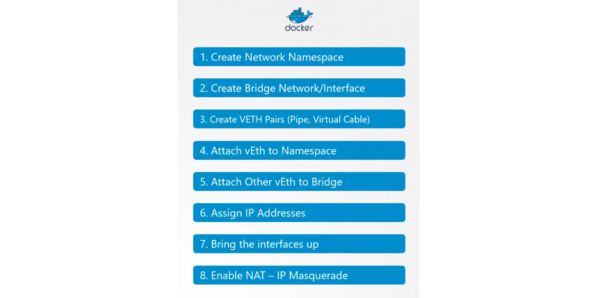
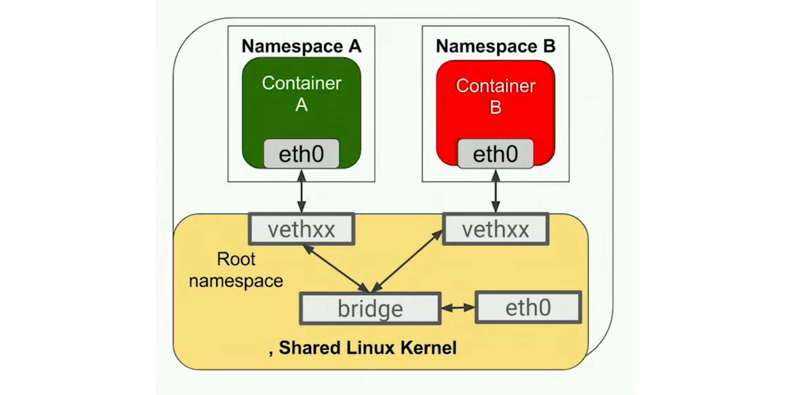

layout: true

.signature[@algogrit]

---

class: center, middle


# Cilium

Gaurav Agarwal

---
class: center, middle

## Who is this class for?

---

- Experienced network engineers

- SRE & devops engineers

- Security engineers

---
class: center, middle

## What are we going to learn?

---
class: center, middle

*Outline*

---

class: center, middle


Software Engineer & Product Developer

Principal Consultant & Founder @ https://codermana.com

ex-Tarka Labs, ex-BrowserStack, ex-ThoughtWorks

---

class: center, middle

Co-organizer of Chennai Go meetup

Volunteer at Golang India - Remote study group

---

class: center, middle

*What we wanted*


---

class: center, middle

*What we got*


---

## As a instructor

- I promise to

  - make this class as interactive as possible

  - use as many resources as available to keep you engaged

  - ensure everyone's questions are addressed

---

## What I need from you

- Be vocal

  - Let me know if there any audio/video issues ASAP

  - Feel free to interrupt me and ask me questions

- Be punctual

- Give feedback

- Work on the exercises

- Be *on mute* unless you are speaking

---
class: center, middle

## Class Progression

---
class: center, middle


---
class: center, middle

Here you are trying to *learn* something, while here your *brain* is doing you a favor by making sure the learning doesn't stick!

---

### Some tips

- Slow down => stop & think
  - listen for the questions and answer

- Do the exercises
  - not add-ons; not optional

- There are no dumb questions!

- Drink water. Lots of it!

---

### Some tips (continued)

- Take notes
  - Try: *Repetitive Spaced Out Learning*

- Talk about it out loud

- Listen to your brain

- *Experiment!*

---
class: center, middle

### 📚 Content ` > ` 🕒 Time

---
class: center, middle

## Show of hands

*Yay's - in Chat*

---
class: center, middle

## Why Cilium?

---
class: center, middle

Let's start with Docker...

---
class: center, middle

### What happens when I run a container and expose a port?

---
class: center, middle

```bash
docker run -d -p 80:80 nginx
```

---

#### Linux Network Namespaces

Network namespaces is a part of containerization technology that is used by the Linux kernel to provide isolation between containers.

It allows, for example, a container to have its own network stack, its own networking configuration, and its own routing configuration.

---

- The tool that is used to operate with `network ns`: `iproute2`

- Network namespaces are stored in `/var/run/netns`

- There are two types of network namespaces:

  - Root namespace `ip link`
  - Non-root namespace `ip netns .. ip link`

---
class: center, middle


---
class: center, middle



.content-credits[https://www.youtube.com/watch?v=l2BS_kuQxBA]

---
class: center, middle

Default docker networking mode: Bridge mode

---
class: center, middle

A `Linux bridge` is a virtual implementation of a physical switch inside of the Linux kernel.

It forwards packets between interfaces that are connected to it. It's usually used for forwarding packets on routers, on gateways, or between VMs and *network namespaces* on a host.

It forwards traffic basing itself on MAC addresses, which are in turn discovered dynamically by inspecting traffic.

---
class: center, middle



---

More info:

```bash
docker network --help
```

---
class: center, middle

### What about tools like Kubernetes, Swarm, Mesos, etc?

---

> For each container that is created, a virtual ethernet device is attached to this bridge, which is then mapped to eth0 inside the container, with an ip within the aforementioned network range. Note that this will happen for each host that is running Docker, without any coordination between the hosts. Therefore, the network ranges might collide.
> Because of this, containers will only be able to communicate with containers that are connected to the same virtual bridge. In order to communicate with other containers on other hosts, they must rely on port-mapping. This means that you need to assign a port on the host machine to each container, and then somehow forward all traffic on that port to that container. What if your application needs to advertise its own IP address to a container that is hosted on another node? It doesn’t actually knows its real IP, since his local IP is getting translated into another IP and a port on the host machine. You can automate the port-mapping, but things start to get kinda complex when following this model.

.content-credits[https://blog.octo.com/en/how-does-it-work-docker-part-2-swarm-networking/]

---
class: center, middle


.content-credits[https://www.youtube.com/watch?v=l2BS_kuQxBA]

---
class: center, middle

Kubernetes chose simplicity and skipped the dynamic port-allocation deal. It just assumes that all containers can communicate with each other without Network Address Translation (NAT), that all containers can communicate with each node (and vice-versa), and that the IP that a container sees for itself is the same that the other containers see for it

.content-credits[https://blog.octo.com/en/how-does-it-work-docker-part-2-swarm-networking/]

---
class: center, middle

### Enter


---

- Originated at `CoreOS` as part of `rkt` (deprecated)

- Now a CNCF project

---
class: center, middle

*CNI consists of a specification and libraries for writing plugins to configure network interfaces in Linux containers, along with a number of supported plugins. CNI concerns itself only with network connectivity of containers and removing allocated resources when the container is deleted. Because of this focus, CNI has a wide range of support and the specification is simple to implement.*

.content-credits[https://github.com/containernetworking/cni]

---
class: center, middle

CNI is used by container runtimes, such as Kubernetes (as shown below), as well as Podman, CRI-O, Mesos, and others.

*To avoid duplication, we think it is prudent to define a common interface between the network plugins and container execution: hence we put forward this specification, along with libraries for Go and a set of plugins.*

---

#### What does the CNI project consist of?

- CNI specifications - Documents what the configuration format is when you call the CNI plugin, what it should do with that information, and the result that plugin should return.

- Set of reference and example plugins - These can help you understand how to write a new plugin or how existing plugins might work. They are cloud-agnostic. These are limited functionality plugins and just for reference.

.content-credits[https://www.redhat.com/sysadmin/cni-kubernetes]

---

The container/pod initially has no network interface. The container runtime calls the CNI plugin with verbs such as ADD, DEL, CHECK, etc. ADD creates a new network interface for the container, and details of what is to be added are passed to CNI via JSON payload.

- Container Runtime must create network namespace
- Identify network the container must attach to
- Container Runtime to invoke Network Plugin (bridge) when container is `ADD`ed
- Container Runtime to invoke Network Plugin (bridge) when container is `DELETE`ed
- JSON format of the network configuration

.content-credits[https://www.youtube.com/watch?v=l2BS_kuQxBA]

---

#### Execution flow of the CNI plugins

- When the container runtime expects to perform network operations on a container, it (like the `kubelet` in the case of K8s) calls the CNI plugin with the desired command.

- The container runtime also provides related network configuration and container-specific data to the plugin.

- The CNI plugin performs the required operations and reports the result.

CNI is called twice by K8s (kubelet) to set up `loopback` and `eth0` interfaces for a pod.

Note: CNI plugins are executable and support ADD, DEL, CHECK, VERSION commands, as discussed above.

.content-credits[https://www.redhat.com/sysadmin/cni-kubernetes]

---

CNI must support:

- Command line arguments ADD/DEL/CHECK
- Parameters like: container id, network ns, etc...
- Must manage IP address assignment to PODs
- Must return results in a specific format

---

Supported CNI plugins:

- Bridge
- VLAN
- IPVLAN
- MACVLAN
- WINDOWS
- Also IPAM plugins like: host-local, DHCP, ...

---
class: center, middle

There are also 3rd party plugins:

- Weave by weaveworks
- Flannel by CoreOS
- Calico project
- NSX by VMWare
- **Cilium by Cilium Inc**

---

#### Why are there multiple plugins?

CNI provides the specifications for various plugins. And as you know, networking is a complex topic with a variety of user needs. Hence, there are multiple CNI plugins that do things differently to satisfy various use cases.

.content-credits[https://www.redhat.com/sysadmin/cni-kubernetes]

---
class: center, middle

Disclaimer: *Docker doesn't use CNI, it uses Container Network Model (CNM) aka Libnetwork*

---
class: center, middle

## What is Cilium?

---
class: center, middle

*Cilium is open source software for providing and transparently securing network connectivity and loadbalancing between application workloads such as application containers or processes.*

*Cilium operates at Layer 3/4 to provide traditional networking and security services as well as Layer 7 to protect and secure use of modern application protocols such as HTTP, gRPC and Kafka. Cilium is integrated into common orchestration frameworks such as Kubernetes.*

.content-credits[https://cilium.io]

---
class: center, middle

*A new Linux kernel technology called eBPF is at the foundation of Cilium. It supports dynamic insertion of eBPF bytecode into the Linux kernel at various integration points such as: network IO, application sockets, and tracepoints to implement security, networking and visibility logic. eBPF is highly efficient and flexible.*

.content-credits[https://github.com/cilium/cilium]

---
class: center, middle


---
class: center, middle

### Features


.content-credits[https://cilium.io]

---
class: center, middle

Code
https://github.com/AgarwalConsulting/Cilium-Training

Slides
https://cilium.slides.agarwalconsulting.io/
