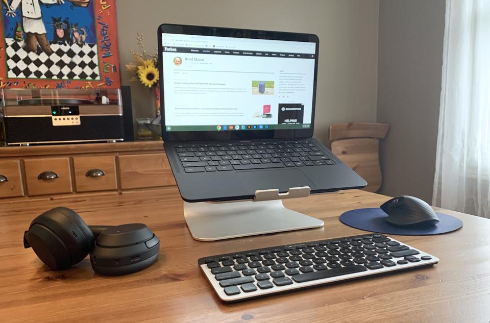

layout: true

.signature[@algogrit]

---

class: center, middle

Gaurav Agarwal

---
class: center, middle

## Who is this class for?

---

- Experienced network engineers

- SRE & devops engineers

- Security engineers

---
class: center, middle

## What are we going to learn?

---

class: center, middle

Software Engineer & Product Developer

Principal Consultant & Founder @ https://codermana.com

ex-Tarka Labs, ex-BrowserStack, ex-ThoughtWorks

---

class: center, middle

Co-organizer of Chennai Go meetup

Volunteer at Golang India - Remote study group

---

class: center, middle

*What we wanted*

---

class: center, middle

*What we got*

---

## As an instructor

- I promise to

  - make this class as interactive as possible

  - use as many resources as available to keep you engaged

  - ensure everyone's questions are addressed

---

## What I need from you

- Be vocal

  - Let me know if there any audio/video issues ASAP

  - Feel free to interrupt me and ask me questions

- Be punctual

- Give feedback

- Work on the exercises

- Be *on mute* unless you are speaking

---
class: center, middle

## Class Progression

---
class: center, middle

Here you are trying to *learn* something, while here your *brain* is doing you a favor by making sure the learning doesn't stick!

.content-credits[https://www.oreilly.com/library/view/head-first-design/0596007124/]

---

### Some tips

- Slow down => stop & think
  - listen for the questions and answer

- Do the exercises
  - not add-ons; not optional

- There are no dumb questions!

- Drink water. Lots of it!

---

### Some tips (continued)

- Take notes
  - Try: *Repetitive Spaced Out Learning*

- Talk about it out loud

- Listen to your brain

- Design something

---
class: center, middle

### 📚 Content ` > ` 🕒 Time

---
class: center, middle

## Show of hands

*Yay's - in Chat*

---
class: center, middle

Code
https://github.com/AgarwalConsulting/Cilium-Training

Slides
https://cilium.slides.agarwalconsulting.io/
