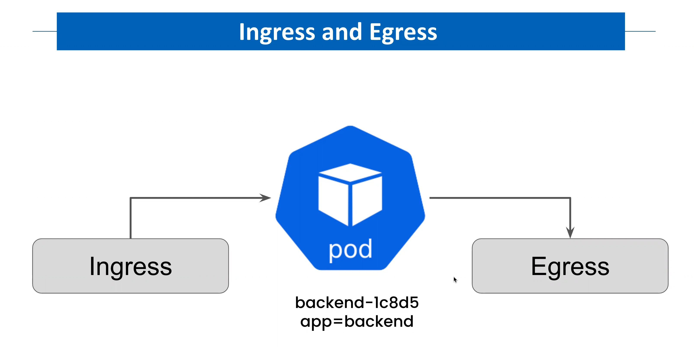
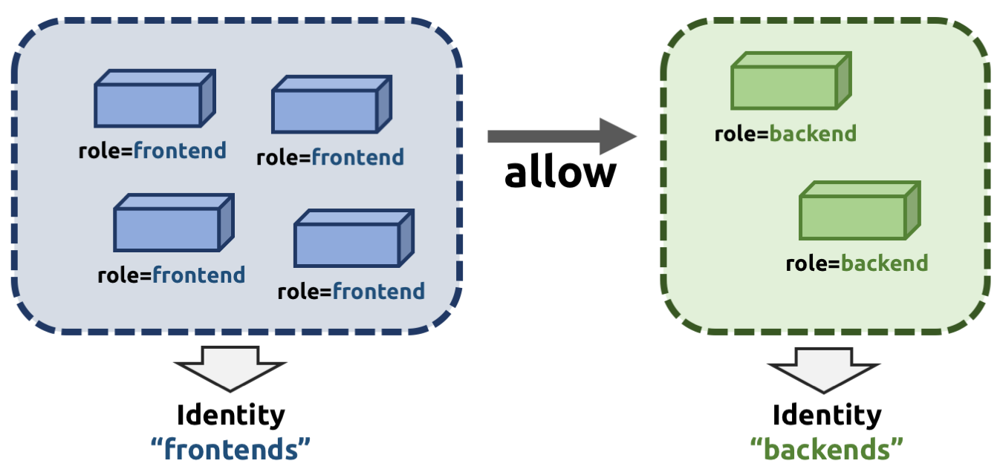

layout: true

.signature[@algogrit]

---

class: center, middle


# Cilium

Gaurav Agarwal

---
class: center, middle

## Who is this class for?

---

- Experienced network engineers

- SRE & devops engineers

- Security engineers

---
class: center, middle

## What are we going to learn?

---
class: center, middle

*Outline*

---

class: center, middle


Software Engineer & Product Developer

Principal Consultant & Founder @ https://codermana.com

ex-Tarka Labs, ex-BrowserStack, ex-ThoughtWorks

---

class: center, middle

Co-organizer of Chennai Go meetup

Volunteer at Golang India - Remote study group

---

class: center, middle

*What we wanted*


---

class: center, middle

*What we got*


---

## As a instructor

- I promise to

  - make this class as interactive as possible

  - use as many resources as available to keep you engaged

  - ensure everyone's questions are addressed

---

## What I need from you

- Be vocal

  - Let me know if there any audio/video issues ASAP

  - Feel free to interrupt me and ask me questions

- Be punctual

- Give feedback

- Work on the exercises

- Be *on mute* unless you are speaking

---
class: center, middle

## Class Progression

---
class: center, middle


---
class: center, middle

Here you are trying to *learn* something, while here your *brain* is doing you a favor by making sure the learning doesn't stick!

---

### Some tips

- Slow down => stop & think
  - listen for the questions and answer

- Do the exercises
  - not add-ons; not optional

- There are no dumb questions!

- Drink water. Lots of it!

---

### Some tips (continued)

- Take notes
  - Try: *Repetitive Spaced Out Learning*

- Talk about it out loud

- Listen to your brain

- *Experiment!*

---
class: center, middle

### 📚 Content ` > ` 🕒 Time

---
class: center, middle

## Show of hands

*Yay's - in Chat*

---
class: center, middle

## Why Cilium?

---
class: center, middle

Let's start with Docker...

---
class: center, middle

### What happens when I run a container and expose a port?

---
class: center, middle

```bash
docker run -d -p 80:80 nginx
```

---

#### Linux Network Namespaces

Network namespaces is a part of containerization technology that is used by the Linux kernel to provide isolation between containers.

It allows, for example, a container to have its own network stack, its own networking configuration, and its own routing configuration.

---

- The tool that is used to operate with `network ns`: `iproute2`

- Network namespaces are stored in `/var/run/netns`

- There are two types of network namespaces:

  - Root namespace `ip link`
  - Non-root namespace `ip netns .. ip link`

---
class: center, middle


.content-credits[https://www.youtube.com/watch?v=QMNbgmxmB-M]

---
class: center, middle


.content-credits[https://www.youtube.com/watch?v=l2BS_kuQxBA]

---
class: center, middle

Default docker networking mode: Bridge mode

---
class: center, middle

A `Linux bridge` is a virtual implementation of a physical switch inside of the Linux kernel.

It forwards packets between interfaces that are connected to it. It's usually used for forwarding packets on routers, on gateways, or between VMs and *network namespaces* on a host.

It forwards traffic basing itself on MAC addresses, which are in turn discovered dynamically by inspecting traffic.

---
class: center, middle

```bash
bridge add <container-id> /var/run/netns/<namespace>
```

---
class: center, middle


.content-credits[https://www.youtube.com/watch?v=Slce9Nu-NB0]

---

More info:

```bash
docker network --help
```

---
class: center, middle

### What about tools like Kubernetes, Swarm, Mesos, etc?

---

*For each container that is created, a virtual ethernet device is attached to this bridge, which is then mapped to `eth0` inside the container, with an ip within the aforementioned network range. Note that this will happen for each host that is running Docker, without any coordination between the hosts. Therefore, the network ranges might collide.*

*Because of this, containers will only be able to communicate with containers that are connected to the same virtual bridge. In order to communicate with other containers on other hosts, they must rely on port-mapping. This means that you need to assign a port on the host machine to each container, and then somehow forward all traffic on that port to that container. What if your application needs to advertise its own IP address to a container that is hosted on another node? It doesn’t actually knows its real IP, since his local IP is getting translated into another IP and a port on the host machine. You can automate the port-mapping, but things start to get kinda complex when following this model.*

.content-credits[https://blog.octo.com/en/how-does-it-work-docker-part-2-swarm-networking/]

---
class: center, middle


.content-credits[https://www.youtube.com/watch?v=l2BS_kuQxBA]

---
class: center, middle

### Enter CNI


---

- Originated at `CoreOS` as part of `rkt` (deprecated)

- Now a CNCF project

---
class: center, middle

*CNI consists of a specification and libraries for writing plugins to configure network interfaces in Linux containers, along with a number of supported plugins. CNI concerns itself only with network connectivity of containers and removing allocated resources when the container is deleted. Because of this focus, CNI has a wide range of support and the specification is simple to implement.*

.content-credits[https://github.com/containernetworking/cni]

---
class: center, middle

CNI is used by container runtimes, such as Kubernetes (as shown below), as well as Podman, CRI-O, Mesos, and others.

*To avoid duplication, we think it is prudent to define a common interface between the network plugins and container execution: hence we put forward this specification, along with libraries for Go and a set of plugins.*

---

#### What does the CNI project consist of?

- CNI specifications - Documents what the configuration format is when you call the CNI plugin, what it should do with that information, and the result that plugin should return.

- Set of reference and example plugins - These can help you understand how to write a new plugin or how existing plugins might work. They are cloud-agnostic. These are limited functionality plugins and just for reference.

.content-credits[https://www.redhat.com/sysadmin/cni-kubernetes]

---

The container/pod initially has no network interface. The container runtime calls the CNI plugin with verbs such as ADD, DEL, CHECK, etc. ADD creates a new network interface for the container, and details of what is to be added are passed to CNI via JSON payload.

- Container Runtime must create network namespace
- Identify network the container must attach to
- Container Runtime to invoke Network Plugin (bridge) when container is `ADD`ed
- Container Runtime to invoke Network Plugin (bridge) when container is `DELETE`ed
- JSON format of the network configuration

.content-credits[https://www.youtube.com/watch?v=l2BS_kuQxBA]

---

#### Execution flow of the CNI plugins

- When the container runtime expects to perform network operations on a container, it (like the `kubelet` in the case of K8s) calls the CNI plugin with the desired command.

- The container runtime also provides related network configuration and container-specific data to the plugin.

- The CNI plugin performs the required operations and reports the result.

CNI is called twice by K8s (kubelet) to set up `loopback` and `eth0` interfaces for a pod.

Note: CNI plugins are executable and support ADD, DEL, CHECK, VERSION commands, as discussed above.

.content-credits[https://www.redhat.com/sysadmin/cni-kubernetes]

---

CNI must support:

- Command line arguments ADD/DEL/CHECK
- Parameters like: container id, network ns, etc...
- Must manage IP address assignment to PODs
- Must return results in a specific format

---
class: center, middle


.content-credits[https://www.youtube.com/watch?v=QMNbgmxmB-M]

---

Supported CNI plugins:

- Bridge
- VLAN
- IPVLAN
- MACVLAN
- WINDOWS
- Also IPAM plugins like: host-local, DHCP, ...

---

There are also 3rd party plugins:

- Weave by weaveworks
- Flannel by CoreOS
- Calico project
- NSX by VMWare
- **Cilium by Cilium Inc**

---

#### Why are there multiple plugins?

*CNI provides the specifications for various plugins. And as you know, networking is a complex topic with a variety of user needs. Hence, there are multiple CNI plugins that do things differently to satisfy various use cases.*

.content-credits[https://www.redhat.com/sysadmin/cni-kubernetes]

---
class: center, middle

*Disclaimer* Docker doesn't use CNI, it uses Container Network Model (CNM) aka *Libnetwork*

---
class: center, middle


.content-credits[https://www.youtube.com/watch?v=QMNbgmxmB-M]

---

### Challenges

- Updates to existing network configuration?

- Every runtime needs a different plugin?

- Security & QoS policies?

---
class: center, middle

Kubernetes chose simplicity and skipped the dynamic port-allocation deal. It just assumes that all containers can communicate with each other without Network Address Translation (NAT), that all containers can communicate with each node (and vice-versa), and that the IP that a container sees for itself is the same that the other containers see for it

.content-credits[https://blog.octo.com/en/how-does-it-work-docker-part-2-swarm-networking/]

---
class: center, middle

`Kubenet` is a very basic, simple network plugin, on Linux only.

`Kubenet plugin`: implements basic `cbr0` using the `bridge` and `host-local` CNI plugins.

It does not, of itself, implement more advanced features like cross-node networking or network policy. It is typically used together with a cloud provider that sets up routing rules for communication between nodes, or in single-node environments.

.content-credits[https://kubernetes.io/docs/concepts/extend-kubernetes/compute-storage-net/network-plugins/#cni]

---
class: center, middle

## What is Cilium?

---
class: center, middle

Cilium is an open source software for providing and transparently securing network connectivity and loadbalancing between application workloads such as application containers or processes.

*Cilium operates at Layer 3/4 to provide traditional networking and security services as well as Layer 7 to protect and secure use of modern application protocols such as HTTP, gRPC and Kafka. Cilium is integrated into common orchestration frameworks such as Kubernetes.*

.content-credits[https://cilium.io]

---
class: center, middle

*A new Linux kernel technology called eBPF is at the foundation of Cilium. It supports dynamic insertion of eBPF bytecode into the Linux kernel at various integration points such as: network IO, application sockets, and tracepoints to implement security, networking and visibility logic. eBPF is highly efficient and flexible.*

.content-credits[https://github.com/cilium/cilium]

---
class: center, middle


.content-credits[https://github.com/cilium/cilium]

---
class: center, middle

### Features


.content-credits[https://cilium.io]

---

#### Protect and secure APIs transparently

- Allow all HTTP requests with method GET and path /public/.*. Deny all other requests.

- Allow service1 to produce on Kafka topic topic1 and service2 to consume on topic1. Reject all other Kafka messages.

- Require the HTTP header X-Token: [0-9]+ to be present in all REST calls.

---

#### Secure service to service communication based on identities

Cilium assigns a security identity to groups of application containers which share identical security policies. The identity is then associated with all network packets emitted by the application containers, allowing to validate the identity at the receiving node. Security identity management is performed using a key-value store.

---

#### Simple Networking

The following multi node networking models are supported:

- **Overlay**: Encapsulation-based virtual network spanning all hosts. Currently VXLAN and Geneve are baked in but all encapsulation formats supported by Linux can be enabled.

  - *When to use this mode*: This mode has minimal infrastructure and integration requirements. It works on almost any network infrastructure as the only requirement is IP connectivity between hosts which is typically already given.

- **Native Routing**: Use of the regular routing table of the Linux host. The network is required to be capable to route the IP addresses of the application containers.

  - *When to use this mode*: This mode is for advanced users and requires some awareness of the underlying networking infrastructure. This mode works well with:

    - Native IPv6 networks
    - In conjunction with cloud network routers
    - If you are already running routing daemons

---

#### Load Balancing

Cilium implements distributed load balancing for traffic between application containers and to external services and is able to fully replace components such as kube-proxy. The load balancing is implemented in eBPF using efficient hashtables allowing for almost unlimited scale.

For north-south type load balancing, Cilium's eBPF implementation is optimized for maximum performance, can be attached to XDP (eXpress Data Path), and supports direct server return (DSR) as well as Maglev consistent hashing if the load balancing operation is not performed on the source host.

For east-west type load balancing, Cilium performs efficient service-to-backend translation right in the Linux kernel's socket layer (e.g. at TCP connect time) such that per-packet NAT operations overhead can be avoided in lower layers.

---

#### Bandwidth Management

Cilium implements bandwidth management through efficient EDT-based (Earliest Departure Time) rate-limiting with eBPF for container traffic that is egressing a node. This allows to significantly reduce transmission tail latencies for applications and to avoid locking under multi-queue NICs compared to traditional approaches such as HTB (Hierarchy Token Bucket) or TBF (Token Bucket Filter) as used in the bandwidth CNI plugin, for example.

---

#### Monitoring and Troubleshooting

- Event monitoring with metadata: When a packet is dropped, the tool doesn't just report the source and destination IP of the packet, the tool provides the full label information of both the sender and receiver among a lot of other information.

- Policy decision tracing: Why is a packet being dropped or a request rejected. The policy tracing framework allows to trace the policy decision process for both, running workloads and based on arbitrary label definitions.

- Metrics export via Prometheus: Key metrics are exported via Prometheus for integration with your existing dashboards.

- Hubble: An observability platform specifically written for Cilium. It provides service dependency maps, operational monitoring and alerting, and application and security visibility based on flow logs.

---
class: center, middle


---

### Integrations

- Network plugin integrations: CNI, `libnetwork`

- Container runtime events: `containerd`

- Kubernetes: `NetworkPolicy`, `Labels`, `Ingress`, `Service`

---

### Local [Setup & Installation](https://github.com/AgarwalConsulting/Cilium-Training/blob/master/Setup.md)

- Minikube
- Kind (Recommended)
- Footloose & K3s

Alternatively, use `vagrant` with `kind`.

---
class: center, middle

## Cilium Components

---

A deployment of Cilium and Hubble consists of the following components running in a cluster:

- Cilium components

  - Cilium Agent
  - Cilium Client (CLI)
  - Operator
  - CNI Plugin

- Hubble components

  - Server
  - Relay
  - Client (CLI)
  - Graphical UI

And relies on:

- eBPF

- Data Store

  - Kubernetes CRDs
  - Key-Value store

---
class: center, middle


---

### Cilium components

#### Agent

The Cilium agent (`cilium-agent`) runs on each node in the cluster. At a high-level, the agent accepts configuration via Kubernetes or APIs that describes networking, service load-balancing, network policies, and visibility & monitoring requirements.

The Cilium agent listens for events from orchestration systems such as Kubernetes to learn when containers or workloads are started and stopped. It manages the eBPF programs which the Linux kernel uses to control all network access in / out of those containers.

#### Cilium Client (CLI)

The Cilium CLI client (`cilium`) is a command-line tool that is installed along with the Cilium agent. It interacts with the REST API of the Cilium agent running on the same node. The CLI allows inspecting the state and status of the local agent. It also provides tooling to directly access the eBPF maps to validate their state.

---

### Cilium components (continued)

#### Operator

The Cilium Operator is responsible for managing duties in the cluster which should logically be handled once for the entire cluster, rather than once for each node in the cluster. The Cilium operator is not in the critical path for any forwarding or network policy decision. A cluster will generally continue to function if the operator is temporarily unavailable. However, depending on the configuration, failure in availability of the operator can lead to:

- Delays in IP Address Management (IPAM) and thus delay in scheduling of new workloads if the operator is required to allocate new IP addresses
- Failure to update the kvstore heartbeat key which will lead agents to declare kvstore unhealthiness and restart.

#### CNI Plugin

The CNI plugin (`cilium-cni`) is invoked by Kubernetes when a pod is scheduled or terminated on a node. It interacts with the Cilium API of the node to trigger the necessary datapath configuration to provide networking, load-balancing and network policies for the pod.

---
class: center, middle

### Hubble

---
class: center, middle

Hubble is a fully distributed networking and security observability platform. It is built on top of Cilium and eBPF to enable deep visibility into the communication and behavior of services as well as the networking infrastructure in a completely transparent manner.

*An observability platform specifically written for Cilium.*

---
class: center, middle

### Hubble components

---

#### Server

The Hubble server runs on each node and retrieves the eBPF-based visibility from Cilium. It is embedded into the Cilium agent in order to achieve high performance and low-overhead. It offers a gRPC service to retrieve flows and Prometheus metrics.

#### Relay

Relay (`hubble-relay`) is a standalone component which is aware of all running Hubble servers and offers cluster-wide visibility by connecting to their respective gRPC APIs and providing an API that represents all servers in the cluster.

---

### Hubble components (continued)

#### Hubble Client (CLI)

The Hubble CLI (`hubble`) is a command-line tool able to connect to either the gRPC API of hubble-relay or the local server to retrieve flow events.

#### Graphical UI (GUI)

The graphical user interface (`hubble-ui`) utilizes relay-based visibility to provide a graphical service dependency and connectivity map.

---
class: center, middle

### eBPF

---
class: center, middle

eBPF is a Linux kernel bytecode interpreter originally introduced to filter network packets, e.g. tcpdump and socket filters.

---
class: center, middle

*eBPF stands for extended Berkeley Packet Filter.*

---
class: center, middle

eBPF is enabling visibility into and control over systems and applications at a granularity and efficiency that was not possible before. It does so in a completely transparent way, without requiring the application to change in any way. eBPF is equally well-equipped to handle modern containerized workloads as well as more traditional workloads such as virtual machines and standard Linux processes.

---
class: center, middle

By leveraging Linux eBPF, Cilium retains the ability to transparently insert security visibility + enforcement, but does so in a way that is based on service / pod / container identity (in contrast to IP address identification in traditional systems) and can filter on application-layer (e.g. HTTP). As a result, Cilium not only makes it simple to apply security policies in a highly dynamic environment by decoupling security from addressing, but can also provide stronger security isolation by operating at the HTTP-layer in addition to providing traditional Layer 3 and Layer 4 segmentation.

---

- It has since been extended with additional data structures such as hashtable and arrays as well as additional actions to support packet mangling, forwarding, encapsulation, etc.

- An in-kernel verifier ensures that eBPF programs are safe to run and a JIT compiler converts the bytecode to CPU architecture specific instructions for native execution efficiency. eBPF programs can be run at various hooking points in the kernel such as for incoming and outgoing packets.

- Hubble can leverage eBPF for visibility. By relying on eBPF, all visibility is programmable and allows for a dynamic approach that minimizes overhead while providing deep and detailed visibility as required by users. Hubble has been created and specifically designed to make best use of these new eBPF powers.

---

- eBPF continues to evolve and gain additional capabilities with each new Linux release. Cilium leverages eBPF to perform core datapath filtering, mangling, monitoring and redirection, and requires eBPF capabilities that are in any Linux kernel version 4.8.0 or newer.

- Cilium recommends to run at least kernel `4.9.17`. (Linux Kernel 5.10 LTS Released in December 2020)

- Cilium is capable of probing the Linux kernel for available features and will automatically make use of more recent features as they are detected.

---
class: center, middle

### Data Store

---
class: center, middle

Cilium requires a data store to propagate state between agents.

---

#### Kubernetes CRDs (Default)

The default choice to store any data and propagate state is to use Kubernetes custom resource definitions (CRDs). CRDs are offered by Kubernetes for cluster components to represent configurations and state via Kubernetes resources.

#### Key-Value Store

All requirements for state storage and propagation can be met with Kubernetes CRDs as configured in the default configuration of Cilium. A key-value store can optionally be used as an optimization to improve the scalability of a cluster as change notifications and storage requirements are more efficient with direct key-value store usage.

The currently supported key-value stores are:

- `etcd`
- `consul`

---
class: center, middle

## Networking with Cilium

---
class: center, middle

Before we begin... Let's understand eBPF better...

---
class: center, middle

### BPF

---
class: center, middle

BPF is a general purpose RISC instruction set and was originally designed for the purpose of writing programs in a subset of C which can be compiled into BPF instructions through a compiler back end (e.g. LLVM), so that the kernel can later on map them through an in-kernel JIT compiler into native opcodes for optimal execution performance inside the kernel.

---

#### Advantages of BPF

- Making the kernel programmable without having to cross kernel / user space boundaries. For example, BPF programs related to networking, as in the case of Cilium, can implement flexible container policies, load balancing and other means without having to move packets to user space and back into the kernel. State between BPF programs and kernel / user space can still be shared through maps whenever needed.

- Given the flexibility of a programmable data path, programs can be heavily optimized for performance also by compiling out features that are not required for the use cases the program solves. For example, if a container does not require IPv4, then the BPF program can be built to only deal with IPv6 in order to save resources in the fast-path.

---

#### Advantages of BPF (continued...)

- In case of networking (e.g. tc and XDP), BPF programs can be updated atomically without having to restart the kernel, system services or containers, and without traffic interruptions. Furthermore, any program state can also be maintained throughout updates via BPF maps.

- BPF provides a stable ABI towards user space, and does not require any third party kernel modules. BPF is a core part of the Linux kernel that is shipped everywhere, and guarantees that existing BPF programs keep running with newer kernel versions. This guarantee is the same guarantee that the kernel provides for system calls with regard to user space applications. Moreover, BPF programs are portable across different architectures.

---

#### Advantages of BPF (continued)

- BPF programs work in concert with the kernel, they make use of existing kernel infrastructure (e.g. drivers, netdevices, tunnels, protocol stack, sockets) and tooling (e.g. iproute2) as well as the safety guarantees which the kernel provides. Unlike kernel modules, BPF programs are verified through an in-kernel verifier in order to ensure that they cannot crash the kernel, always terminate, etc. XDP programs, for example, reuse the existing in-kernel drivers and operate on the provided DMA buffers containing the packet frames without exposing them or an entire driver to user space as in other models. Moreover, XDP programs reuse the existing stack instead of bypassing it. BPF can be considered a generic “glue code” to kernel facilities for crafting programs to solve specific use cases.

---
class: center, middle

*The execution of a BPF program inside the kernel is always event-driven!*

---

#### Events like

- A networking device which has a BPF program attached on its ingress path will trigger the execution of the program once a packet is received.

- A kernel address which has a `kprobe` with a BPF program attached will trap once the code at that address gets executed, which will then invoke the `kprobe`’s callback function for instrumentation, subsequently triggering the execution of the attached BPF program.

---
class: center, middle

#### Sample BPF program


.content-credits[https://www.youtube.com/watch?v=Kmm8Hl57WDU]

---
class: center, middle

e**X**press **D**ata **P**ath

---
class: center, middle

*The XDP BPF hook is at the earliest point possible in the networking driver and triggers a run of the BPF program upon packet reception.*

---
class: center, middle

This achieves the best possible packet processing performance since the program runs directly on the packet data before any other processing can happen. This hook is ideal for running filtering programs that drop malicious or unexpected traffic, and other common DDOS protection mechanisms.

*XDP is a further step in evolution of BPF and enables to run a specific flavor of BPF programs from the network driver with direct access to the packet's DMA buffer.*

---

class: center, middle

#### Default Network path (Layer 1)


.content-credits[https://www.youtube.com/watch?v=Kmm8Hl57WDU]

---
class: center, middle

#### Default Network path (Layer 2)


.content-credits[https://www.youtube.com/watch?v=Kmm8Hl57WDU]

---
class: center, middle


*Networking programs in BPF, in particular for `tc` and `XDP` do have an offload-interface to hardware in the kernel in order to execute BPF code directly on the NIC.*

---
class: center, middle

#### Default Network path (Layer 2 & 3)


.content-credits[https://www.youtube.com/watch?v=Kmm8Hl57WDU]

---
class: center, middle

#### Default Network path (Layer 3 & 4)


.content-credits[https://www.youtube.com/watch?v=Kmm8Hl57WDU]

---
class: center, middle

#### Default Network path (Layer 4)


.content-credits[https://www.youtube.com/watch?v=Kmm8Hl57WDU]

---
class: center, middle

#### Default Network path (Layer 4 - User Space)


.content-credits[https://www.youtube.com/watch?v=Kmm8Hl57WDU]

---
class: center, middle


.content-credits[https://www.youtube.com/watch?v=Kmm8Hl57WDU]

---
class: center, middle


.content-credits[https://github.com/cilium/cilium#what-is-ebpf-and-xdp]

---
class: center, middle


.content-credits[https://www.youtube.com/watch?v=Kmm8Hl57WDU]

---
class: center, middle

Depending on the Linux kernel version being used, the eBPF datapath can implement a varying feature set fully in eBPF. If certain required capabilities are not available, the functionality is provided using a legacy iptables implementation.

.content-credits[[Features matrix](https://docs.cilium.io/en/v1.8/operations/system_requirements/#features-kernel-matrix)]

---
class: center, middle

`More info on BPF` - [Cilium's BPF guide](https://docs.cilium.io/en/v1.8/bpf/#bpf-guide)

---
class: middle

- eBPF is hard to write

- Cilium is ... uhm ... easi(er)?

- Cilium is a CNI & *can be a replacement for `kube-proxy`*

.content-credits[https://docs.google.com/presentation/d/1KBKfseEHbTK4DB-SCuEzze7Fb58s3yCKio-OZDvPcbk/edit#slide=id.g78ed7bc73c_0_277]

---
class: center, middle

### Routing in Cilium

---
class: center, middle

#### Encapsulation mode

---
class: center, middle

##### Anatomy of a network packet


.content-credits[https://www.tigera.io/lp/kubernetes-networking-ebook/]

---
class: center, middle

Cilium automatically runs in *Encapsulation* mode as it is the mode with the fewest requirements on the underlying networking infrastructure.

---
class: center, middle

In this mode, all cluster nodes form a mesh of tunnels using the UDP-based encapsulation protocols `VXLAN` or `Geneve`. All traffic between Cilium nodes is encapsulated.

---

##### VXLAN

`VXLAN` is an encapsulation protocol that provides data center connectivity using tunneling to stretch Layer 2 connections over an underlying Layer 3 network.

It uses `UDP` packets to wrap the `IP` packets. <sup>[[1]](https://www.juniper.net/us/en/research-topics/what-is-vxlan.html)</sup>

##### Geneve

The stated goal of `GENEVE` is to define an encapsulation data format only.

`GENEVE` encapsulated packets are designed to be transmitted via standard networking equipment. Packets are sent from one tunnel endpoint to one or more tunnel endpoints using either unicast or multicast addressing. <sup>[[2]](https://www.redhat.com/en/blog/what-geneve)</sup>

---
class: center, middle

*Demo*: Hello, Kubernetes!

---
class: center, middle

An *overlay* network is a telecommunications network that is built on top of another network and is supported by its infrastructure. An *overlay* network decouples network services from the underlying infrastructure by encapsulating one packet inside of another packet.

---
class: center, middle

##### Anatomy of a overlay network packet


.content-credits[https://www.tigera.io/lp/kubernetes-networking-ebook/]

---

Overlay networks have the advantage of having minimal dependencies on the underlying network infrastructure, but have the downsides of:

- having a small performance impact compared to non-overlay networking, which you might want to avoid if running network intensive workloads

- workloads on the overlay are not easily addressable from the rest of the network. so NAT gateways or load balancers are required to bridge between the overlay and the underlay network for any ingress to, or egress from, the overlay.

.content-credits[https://www.tigera.io/lp/kubernetes-networking-ebook/]

---

##### Advantages of overlay

###### Simplicity

The network which connects the cluster nodes does not need to be made aware of the PodCIDRs. Cluster nodes can spawn multiple routing or link-layer domains. The topology of the underlying network is irrelevant as long as cluster nodes can reach each other using IP/UDP.

###### Addressing space

Due to not depending on any underlying networking limitations, the available addressing space is potentially much larger and allows to run any number of pods per node if the PodCIDR size is configured accordingly.

---

##### Advantages of overlay (continued)

###### Auto-configuration

When running together with an orchestration system such as Kubernetes, the list of all nodes in the cluster including their associated allocation prefix node is made available to each agent automatically. New nodes joining the cluster will automatically be incorporated into the mesh.

###### Identity context

Encapsulation protocols allow for the carrying of metadata along with the network packet. Cilium makes use of this ability to transfer metadata such as the source security identity. The identity transfer is an optimization designed to avoid one identity lookup on the remote node.

---

#### Other routing modes

- Native routing

In native routing mode, Cilium will delegate all packets which are not addressed to another local endpoint to the routing subsystem of the Linux kernel.

- AWS ENI

It is a special purpose datapath that is useful when running Cilium in an AWS environment.

- Google Cloud

It is possible to utilize the Google Cloud’s networking layer with Cilium running in a Native-Routing configuration.

.content-credits[https://docs.cilium.io/en/v1.8/concepts/networking/routing/]

---
class: center, middle

### IP Address Management (IPAM)

---
class: center, middle

IPAM (IP Address Management) is the administration of DNS and DHCP, which are the network services that assign and resolve IP addresses to machines in a TCP/IP network.

---
class: center, middle

Simply put, IPAM is a means of planning, tracking, and managing the Internet Protocol address space used in a network. Most commonly, tools such as DNS and DHCP are used in tandem to perform this task, though true IPAM will glue these services together so that each is aware of changes in the other (for instance DNS knowing of the IP address taken by a client via DHCP, and updating itself accordingly).

---
class: center, middle

*IP Address Management (IPAM) is responsible for the allocation and management of IP addresses used by network endpoints (container and others) managed by Cilium.*

---

In Kubernetes, there are 3 entities which have IPs assigned:

- Pods
  - Containers in a Pod share the same IP

- Service

- Nodes

---

Various IPAM modes are supported to meet the needs of different users:

- *Cluster Scope (Default)*

- *Kubernetes Host Scope*

- > Azure IPAM (beta)

- > AWS ENI

- > Google Kubernetes Engine

- > CRD-Backed

- > Host Scope (Legacy)

---

#### CIDR Refresher

- 10.0.0.0/8

- 192.168.0.0/16

- 172.16.0.0/12

- 169.254.0.0/16

What do these values mean?

---

##### Private IPv4 ranges

- **10.0.0.0/8**

- **192.168.0.0/16**

- **172.16.0.0/12**

---
class: center, middle

#### Cluster Scope

---
class: center, middle

The cluster-scope IPAM mode assigns per-node PodCIDRs to each node and allocates IPs using a host-scope allocator on each node.

---
class: center, middle

##### Architecture of Cluster Scope


---
class: center, middle

This is useful if Kubernetes cannot be configured to hand out `PodCIDRs` or if more control is needed.

*The advantage of this mode is that it does not depend on Kubernetes being configured to hand out per-node PodCIDRs.*

---
class: center, middle

In this mode, the Cilium agent will wait on startup until the `PodCIDRs` range are made available via the Cilium Node `v2.CiliumNode` object for all enabled address families via the resource field set in the `v2.CiliumNode`: `Spec.IPAM.PodCIDRs`.

---
class: center, middle

It is similar to the Kubernetes Host Scope mode.

---
class: center, middle

#### Kubernetes Host Scope

---
class: center, middle

The Kubernetes host-scope IPAM mode is enabled with `ipam: kubernetes` and delegates the address allocation to each individual node in the cluster. IPs are allocated out of the `PodCIDR` range associated to each node by Kubernetes.

---
class: center, middle

##### Architecture of K8s Host Scope


---

##### Configuration of K8s Host Scope

The following ConfigMap options exist to configure Kubernetes host scope:

- `ipam: kubernetes` - Enables Kubernetes IPAM mode. Enabling this option will automatically enable `k8s-require-ipv4-pod-cidr` if `enable-ipv4` is true and `k8s-require-ipv6-pod-cidr` if `enable-ipv6` is true.

- `k8s-require-ipv4-pod-cidr: true` - instructs the Cilium agent to wait until an IPv4 PodCIDR is made available via the Kubernetes node resource.

- `k8s-require-ipv6-pod-cidr: true` - instructs the Cilium agent to wait until an IPv6 PodCIDR is made available via the Kubernetes node resource.

.content-credits[https://docs.cilium.io/en/v1.8/concepts/networking/ipam/kubernetes/]

---
class: center, middle

#### Cilium Container Networking Control Flow


---

### Other terms

- Egress / Ingress



---

- [Masquerade](https://docs.cilium.io/en/v1.8/concepts/networking/masquerading/)

  - Masquerading is the process of redirecting traffic from one network to another.

  - Masquerading is a security feature that allows traffic from one network to be routed to another.

---
class: center, middle


---
class: center, middle

## Network Security

---
class: center, middle

*Cilium provides security on multiple levels. Each can be used individually or combined together.*

---

- Identity-based: Connectivity policies between endpoints (Layer 3), e.g. any endpoint with label `role=frontend` can connect to any endpoint with label `role=backend`.

- Restriction of accessible ports (Layer 4) for both incoming and outgoing connections, e.g. endpoint with label `role=frontend` can only make outgoing connections on port `443` (https) and endpoint `role=backend` can only accept connections on port `443` (https).

- Fine grained access control on application protocol level to secure HTTP and remote procedure call (RPC) protocols, e.g the endpoint with label `role=frontend` can only perform the REST API call `GET /userdata/[0-9]+`, all other API interactions with `role=backend` are restricted.

---
class: center, middle

### Identity-based

---
class: center, middle

*Traditionally security enforcement architectures have been based on IP address filters.*

---
class: center, middle

Cilium entirely separates security from network addressing. Instead, security is based on the identity of a pod, which is derived through labels. This identity can be shared between pods.

---
class: center, middle



---
class: center, middle

### Policy enforcement

---
class: center, middle

All security policies are described assuming stateful policy enforcement for session based protocols.

---
class: center, middle

This means that the intent of the policy is to describe allowed direction of connection establishment.

---
class: center, middle

If the policy allows `A => B` then reply packets from `B` to `A` are automatically allowed as well. However, `B` is not automatically allowed to initiate connections to `A`. If that outcome is desired, then both directions must be explicitly allowed.

---
class: center, middle

Security policies may be enforced at `ingress` or `egress`.

---

- For `ingress`, this means that each cluster node verifies all incoming packets and determines whether the packet is allowed to be transmitted to the intended endpoint.

- For `egress` each cluster node verifies outgoing packets and determines whether the packet is allowed to be transmitted to its intended destination.

---
class: center, middle

#### Default Security Policy?

---
class: center, middle

*allow all communication!*

---
class: center, middle

### Proxy Injection

---
class: center, middle

Cilium is capable of transparently injecting a Layer 4 proxy into any network connection. This is used as the foundation to enforce higher level network policies (like DNS based and Layer 7 policies).

---
class: center, middle

## Kubernetes Integration

---
class: center, middle


---
class: center, middle

In just a moment...

---
class: center, middle

Review of [RV store application](https://github.com/AgarwalConsulting/Cilium-Training/tree/master/examples/03-rvstore) in K8s cluster with default CNI

---

### Understanding K8s terminology

- Node

- Pod

---

- Service

  > Service is an abstraction which defines a logical set of Pods and a policy by which to access them

  - They work using `Selectors` & `Labels`

- Endpoint

  > Endpoints is a collection of endpoints that implement the actual service.

- EndpointSlices

  > EndpointSlices are an API resource that can provide a more scalable alternative to Endpoints. Although conceptually quite similar to Endpoints

---

```yaml
matchLabels:
  app: shopping
```

---

```yaml
matchLabels: {}
```

---

*A Kubernetes Service is an abstraction which defines a logical set of Pods and a policy by which to access them - sometimes called a micro-service.*

---
class: center, middle

Review of [RV store application](https://github.com/AgarwalConsulting/Cilium-Training/tree/master/examples/03-rvstore) in K8s cluster with Cilium

---
class: center, middle

Kubernetes also has a concept of a `NetworkPolicy`.

.content-credits[https://kubernetes.io/docs/concepts/services-networking/network-policies/]

---
class: center, middle

### Network Policy

---
class: center, middle

Network policy is the primary tool for securing a Kubernetes network. It allows you to easily restrict the network traffic in your cluster so only the traffic that you want to flow is allowed.

---
class: center, middle

*Historically in enterprise networks, network security was provided by designing a physical topology of network devices (switches, routers, firewalls) and their associated configuration. The physical topology defined the security boundaries of the network. In the first phase of virtualization, the same network and network device constructs were virtualized in the cloud, and the same techniques for creating specific network topologies of (virtual) network devices were used to provide network security. Adding new applications or services often required additional network design to update the network topology and network device configuration to provide the desired security.*

---
class: center, middle

In contrast, the Kubernetes network model defines a “flat” network in which every pod can communicate with all other pods in the cluster using pod IP addresses.

*This approach massively simplifies network design and allows new workloads to be scheduled dynamically anywhere in the cluster with no dependencies on the network design.*

---
class: center, middle

NetworkPolicies are an application-centric construct which allow you to specify how a pod is allowed to communicate with various network "entities".

---
class: center, middle

*If you want to control traffic flow at the IP address or port level (OSI layer 3 or 4), then you might consider using Kubernetes NetworkPolicies for particular applications in your cluster.*

---

#### Anatomy of a Network Policy

A NetworkPolicy is a YAML file that defines a set of rules for traffic to and from a pod.

1. Which pods does it apply to?

2. for which direction? (ingress, egress)

3. Rules for allowing:

  - ingress -> who can connect to this Pod?

  - egress -> where can this Pod connect to?

---
class: center, middle

```yaml
kind:     NetworkPolicy
apiVersion:  networking.k8s.io/v1
metadata:
  name: "Disallow all"
spec:
  podSelector: {...}
  ingress:
  - ...
  - ...
  egress:
  - ...
  - ...
```

---

The entities that a Pod can communicate with are identified through a combination of the following 3 identifiers:

- Other pods that are allowed (exception: a pod cannot block access to itself)

- Namespaces that are allowed

- IP blocks (exception: traffic to and from the node where a Pod is running is always allowed, regardless of the IP address of the Pod or the node)

---

#### Rules of `NetworkPolicy`

1. traffic is `allowed`

  unless there is a `NetworkPolicy` selecting the pod.

2. traffic is `denied`

  if there are policies selecting the pod, but none of them have any rules allowing it.

> NetworkPolicy, per spec, defines rules that allow traffic.

3. traffic is `allowed`

  if at least one policy allowing it.

---
class: center, middle

*Kubernetes itself does not enforce network policies, and instead delegates their enforcement to network plugins.*

---

The main features of Kubernetes network policies are:

- Policies are namespace scoped (i.e. you create them within the context of a specific namespace just like, for example, pods)

- Policies are applied to pods using label selectors

- Policy rules can specify the traffic that is allowed to/from other pods, namespaces, or CIDRs

- Policy rules can specify protocols (`TCP`, `UDP`, `SCTP`), named ports or port numbers

---
class: center, middle

Code
https://github.com/AgarwalConsulting/Cilium-Training

Slides
https://cilium.slides.agarwalconsulting.io/
